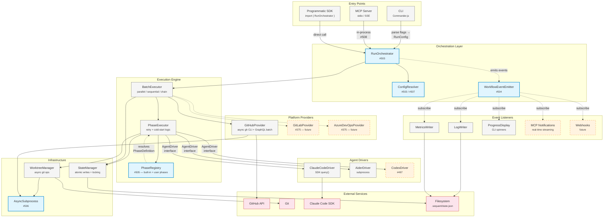
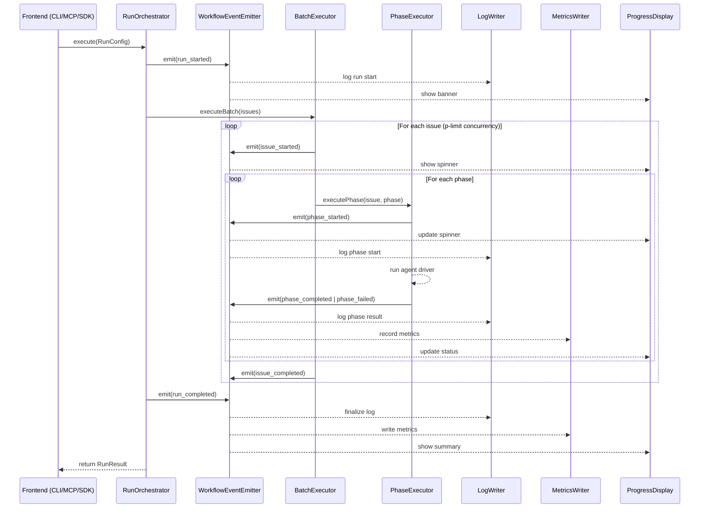
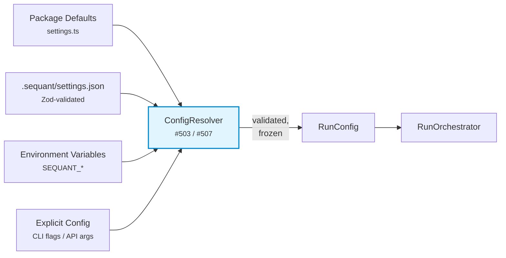
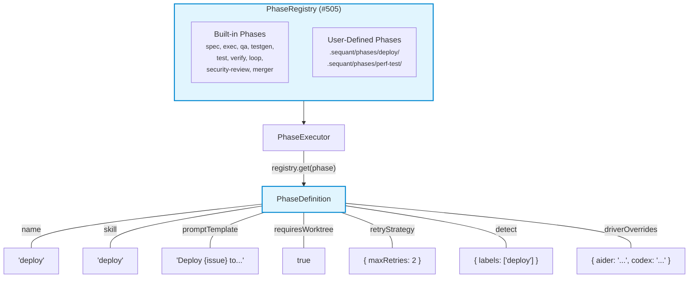
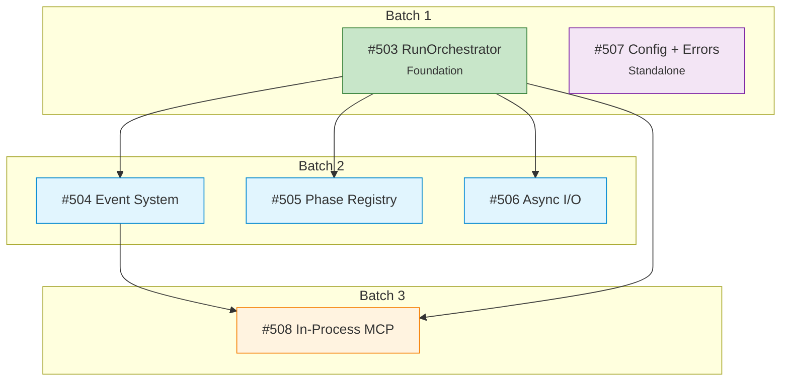

# Sequant Target Architecture

> Post #503-#508 architecture. This is the design we're building toward.

## System Overview

## Layer Responsibilities

```mermaid
graph LR
    subgraph L1["Layer 1: Entry Points"]
        direction TB
        L1A["Parse input format<br/>(CLI flags, MCP params, API args)"]
        L1B["Convert to RunConfig"]
        L1C["Format output<br/>(terminal, MCP response, return value)"]
    end

    subgraph L2["Layer 2: Orchestration"]
        direction TB
        L2A["Resolve configuration<br/>(defaults → settings → env → explicit)"]
        L2B["Coordinate execution<br/>(batch/chain/sequential mode)"]
        L2C["Emit lifecycle events"]
    end

    subgraph L3["Layer 3: Execution"]
        direction TB
        L3A["Execute individual phases"]
        L3B["Resolve phase definitions<br/>(built-in + user-defined)"]
        L3C["Retry with error classification"]
    end

    subgraph L4["Layer 4: Infrastructure"]
        direction TB
        L4A["Git worktree lifecycle"]
        L4B["Persistent state (atomic R/W)"]
        L4C["Async subprocess execution"]
        L4D["Platform API abstraction"]
    end

    L1 --> L2 --> L3 --> L4

    classDef layer fill:#f5f5f5,stroke:#424242
    class L1,L2,L3,L4 layer
```

## Event Flow

## Configuration Resolution

## Phase Registry

## Dependency Graph (Issues)

## Color Key

| Color | Meaning |
|-------|---------|
| Blue fill | New component (from #503-#508) |
| Orange dashed | Future / planned |
| Gray fill | Existing component (unchanged or refactored) |
| Pink fill | External service |
