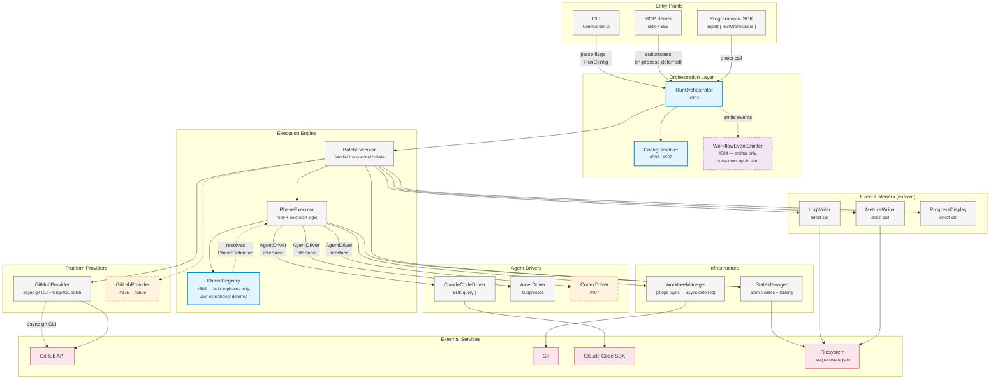
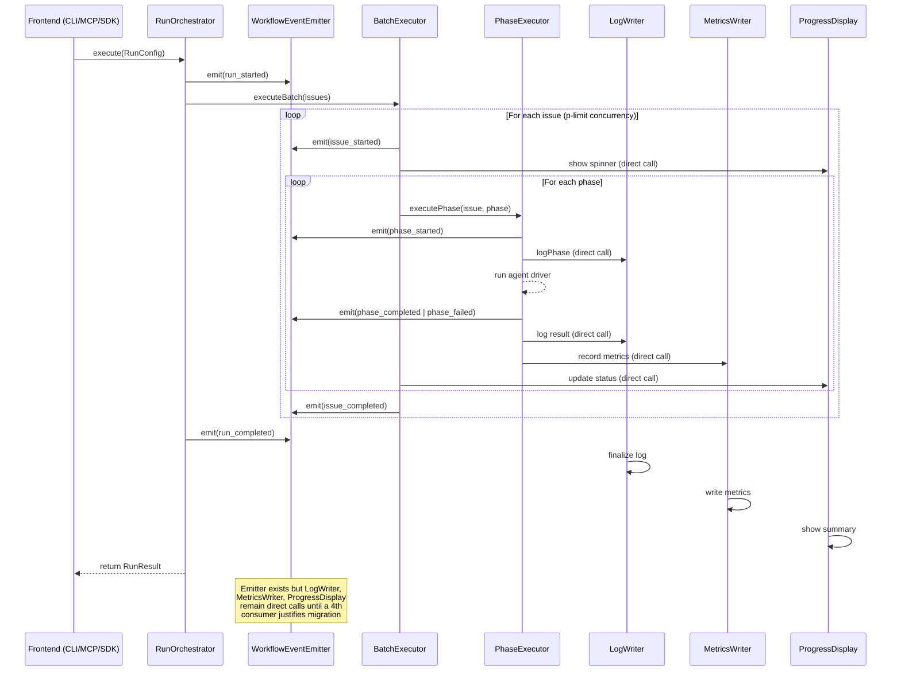
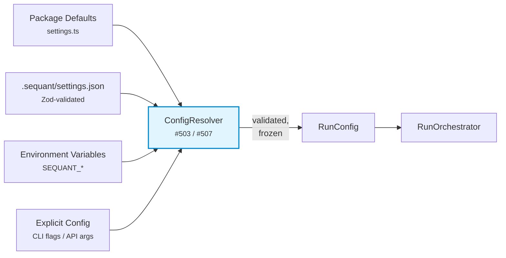
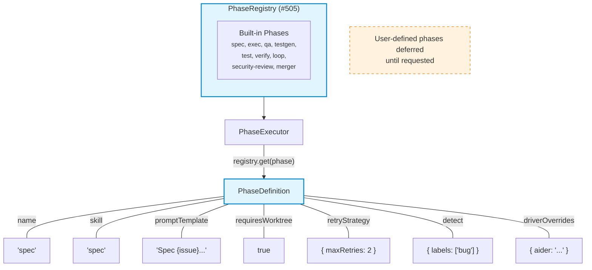
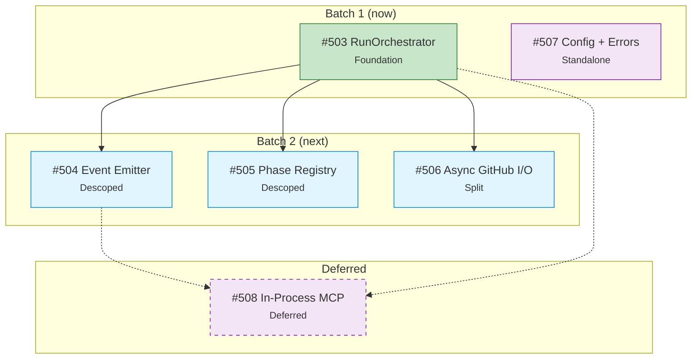

# Sequant Target Architecture

> Post #503-#508 architecture, scoped after overcomplexity review (2026-04-08).
>
> Guiding principle: **build the tool, not the framework.** Abstractions are added
> when a second consumer forces them, not when the diagram looks prettier.

## System Overview

## Scope Decisions (2026-04-08)

| Issue | Original Scope | Revised Scope | Rationale |
|-------|---------------|---------------|-----------|
| #503 | RunOrchestrator extraction | **Unchanged** | run.ts is 1,171 lines — real problem |
| #507 | Config validation + error types | **Unchanged** | Boundary hardening, quick win |
| #504 | Full event system + consumer migration | **Emitter only** — no LogWriter/MetricsWriter/spinner refactoring | Event bus with 2 riders; migrate consumers when a 4th arrives |
| #505 | Phase plugin framework | **Registry class only** — no user-defined phases, no CLI command | 0 users asking for plugins; consolidate internals only |
| #506 | All async I/O (~30 call sites) | **GitHubProvider async only** — defer WorktreeManager | GitHub API is the bottleneck; worktree ops are per-issue sequential |
| #508 | In-process MCP engine | **Deferred** — fix log polling race separately | Dependency chain cost > benefit at current adoption |

## Layer Responsibilities

```mermaid
graph LR
    subgraph L1["Layer 1: Entry Points"]
        direction TB
        L1A["Parse input format<br/>(CLI flags, MCP params, API args)"]
        L1B["Convert to RunConfig"]
        L1C["Format output<br/>(terminal, MCP response, return value)"]
    end

    subgraph L2["Layer 2: Orchestration"]
        direction TB
        L2A["Resolve configuration<br/>(defaults → settings → env → explicit)"]
        L2B["Coordinate execution<br/>(batch/chain/sequential mode)"]
        L2C["Emit lifecycle events<br/>(optional — consumers opt in)"]
    end

    subgraph L3["Layer 3: Execution"]
        direction TB
        L3A["Execute individual phases"]
        L3B["Resolve phase definitions<br/>(built-in registry)"]
        L3C["Retry with error classification"]
    end

    subgraph L4["Layer 4: Infrastructure"]
        direction TB
        L4A["Git worktree lifecycle"]
        L4B["Persistent state (atomic R/W)"]
        L4C["Platform API abstraction<br/>(async GitHubProvider)"]
    end

    L1 --> L2 --> L3 --> L4

    classDef layer fill:#f5f5f5,stroke:#424242
    class L1,L2,L3,L4 layer
```

## Event Flow

## Configuration Resolution

## Phase Registry

## Dependency Graph (Issues)

## Deferred Work

Items intentionally excluded from this iteration. Revisit when triggered:

| Item | Trigger to Revisit |
|------|-------------------|
| User-defined phases (`.sequant/phases/`) | A user files an issue requesting custom phases |
| Event listener migration (LogWriter, MetricsWriter, spinners) | A 4th event consumer is needed (webhooks, VS Code extension) |
| WorktreeManager async migration | Profiling shows git ops as a parallel execution bottleneck |
| In-process MCP engine (#508) | MCP usage grows, or #383 interactive relay becomes priority |
| GitLabProvider / AzureDevOpsProvider | User requests non-GitHub platform support |
| AsyncSubprocess abstraction | Multiple subsystems need shared process lifecycle management |

## Color Key

| Color | Meaning |
|-------|---------|
| Blue fill | New component (active scope) |
| Purple dashed | Deferred — designed but not built yet |
| Orange dashed | Future / planned |
| Gray fill | Existing component (unchanged or refactored) |
| Pink fill | External service |
