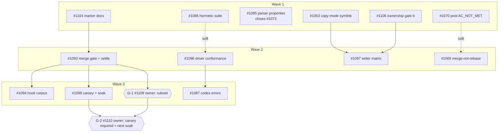

# Issue graph — guard-2026-09

Companion to `PLAN.md`. All nodes pre-exist; G-1 and G-2 are the only new
issues. Numbers below are GitHub numbers.

## Nodes

| Node | Tier | Wave | May touch | Blocked by |
|---|---|---|---|---|
| #1104 marker contract docs | mechanical | 1 | `CLAUDE.md`, exec `SKILL.md` ×3, `scripts/lint-skill-gates.test.ts` (or new `scripts/exec-skill-marker.test.ts`) | — |
| #1086 hermetic suite | mechanical | 1 | `vitest.config.ts`, `vitest.global-setup.ts` (or a new `vitest.setup.ts`), the two named test files | — |
| #1095 parser properties | mechanical | 1 | `package.json`, `package-lock.json`, `src/lib/ac-parser.property.test.ts`, `src/lib/workflow/{phase-executor,mutation-marker,qa-gaps-marker}.property.test.ts`, `src/lib/workflow/phase-executor.ts` (`parseQaSummary`), `src/lib/workflow/batch-executor.ts` (**`buildQaVerdictComment` only**) | — |
| #1053 copy-mode symlink | mechanical | 1 | `src/lib/templates.ts` (`copyTemplates`), `src/lib/templates.test.ts` (**append only**), `src/commands/{doctor,sync}.ts` + tests | — |
| #1106 ownership gate side (b) | mechanical | 1 | new `src/lib/ownership-gate.ts`, new `src/lib/ownership-gate.test.ts`, `src/lib/templates.test.ts` (**delete the old side-(b) block only**), `CHANGELOG.md` | — (#1090 merged) |
| #1070 post AC_NOT_MET | mechanical | 1 | `src/lib/workflow/batch-executor.ts` (**the `postQaVerdictComment` call-site gate only**), `batch-executor.test.ts` | — |
| #1093 merge gate + settle script | judgment | 2 | `scripts/settle-against-base.sh`, `scripts/settle-against-base.test.ts`, `scripts/ruleset-main.sh`, `CLAUDE.md`, exec `SKILL.md` ×3, qa `SKILL.md` ×3, release `SKILL.md` ×3 (red-main line), `scripts/preexisting-claim-gate.test.ts`, `docs/internal/graph-2026-09-guard/ruleset.md` | #1104 |
| #1096 driver conformance | judgment | 2 | `src/lib/workflow/drivers/__tests__/driver-conformance.test.ts`, `drivers/__fixtures__/`, `drivers/index.ts` (adapter registration only), `docs/` driver-authoring page | — (wave-balanced) |
| #1097 writer state matrix | mechanical | 2 | `src/lib/__tests__/writer-state-matrix.test.ts` (new); read-only on `templates.ts`, `init.ts`, `sync.ts`, `update.ts` | #1053, #1106 |
| #1069 qa merge-not-rebase | mechanical | 2 | `src/lib/workflow/worktree-manager.ts` (`rebaseBeforePR`), `batch-executor.ts` call site, tests | — (after #1070, same file) |
| #1094 hook golden corpus | mechanical | 3 | `__tests__/fixtures/hook-corpus.jsonl`, `__tests__/hook-corpus.integration.test.ts`, `scripts/hook-corpus.ts` + `scripts/hook-corpus.test.ts`, exec `SKILL.md` ×3 | #1093 |
| #1087 codex usage-limit mapping | mechanical | 3 | `src/lib/workflow/drivers/codex.ts`, `codex.test.ts`, `batch-executor.test.ts` (AC-4 fixture) | #1096 |
| #1098 downstream canary + next soak | mechanical | 3 | `.github/workflows/ci.yml`, `__tests__/canary/downstream.integration.test.ts`, `__tests__/canary/fixture/`, release `SKILL.md` ×3, `src/lib/__tests__/release-skill-soak.test.ts` | #1093 |
| G-1 = #1109 owner: apply the `main` ruleset | human gate | 3 | GitHub ruleset only | #1093 |
| G-2 = #1110 owner: require canary, `next` soak, promote | human gate | 4 | GitHub ruleset, npm dist-tags | #1098, G-1 |

## Mermaid DAG

Solid edges are `Blocked by` markers. Dotted edges are wave ordering only
(shared file or suite hygiene) and are not stamped.

## Critical path

#1104 → #1093 → #1098 → G-2 (four hops). #1093 is the pivot: it owns the
exec-skill file for wave 2 and both wave-3 CI nodes wait on it.

## Wave 1 launch (what `/graph-run` reads)

Six nodes, no edges among them. Shared-file rules for the wave:
- `src/lib/templates.test.ts`: #1053 appends; #1106 deletes the old side-(b)
  block only (D-9). Runner merges #1053 first if both are ready.
- `src/lib/workflow/batch-executor.ts`: #1095 edits `buildQaVerdictComment`
  only; #1070 edits the `postQaVerdictComment` call-site gate only (D-10).
- Nothing else in wave 1 shares a file.

## Anti-gap passes

1. **Bug-class walk** (journey walk for a guard graph). "Other case never
   tested" → #1094 (hook forms), #1095 (parser shapes), #1097 (writer
   states), #1096 (driver contract). "Field only" → #1098 (downstream
   fixture, stale local install, previous-minor upgrade), #1094 (harvested
   real commands). "Silent non-action" → #1087 (typed error engages
   `--auto-wait`), #1070 (verdict posted), #1053 AC-2 (doctor hint that
   changes nothing). "Unverified pre-existing claim" → #1093 script + qa
   rejection + G-1 required checks; #1086 removes the source of the claim.
   Every one of the 16 rows in PLAN §1 maps to at least one node. #1069 is
   the only bug with no guard, by D-6.
2. **Artifact walk.** Corpus file (#1094, harvested by a maintainer step,
   redacted, committed); ruleset payload (#1093 emits, G-1 applies);
   settle block in PR bodies (#1093 produces, qa skill consumes); fixture
   downstream project (#1098 builds, canary consumes); conformance
   fixtures per driver (#1096 owns, #1087 adds the run-2 text); property
   seeds (`FC_SEED`, #1095); npm `next` tarball (#1098 release skill
   publishes, G-2 soaks). Each has one owner and a stated failure mode in
   PLAN §6.
3. **Producer/consumer.** Human-produced inputs: the ruleset (G-1), the
   soak decision (G-2), the corpus harvest run (#1094, local machine),
   `codex`/`opencode` binaries on the runner host (#1096 skips with reason
   when absent), the previous-minor npm release (exists: 2.15.x). Every
   consumed test fixture has a producing node in the same or an earlier
   wave.
4. **Shared-file ownership.** Exec `SKILL.md` ×3: #1104 (w1) → #1093 (w2)
   → #1094 (w3), one owner per wave, byte-identical rule. qa `SKILL.md` ×3:
   #1093 only. Release `SKILL.md` ×3: #1093 (red-main line, w2) → #1098
   (`next`/`--soaked`, w3). `CLAUDE.md`: #1104 (w1) → #1093 (w2).
   `templates.test.ts` and `batch-executor.ts`: region rules above.
   `mutation-marker.ts`: #1095 only (D-8 removes #1104's claim).
   `package.json`: #1095 only. `vitest.config.ts`: #1086 only (#1095 sets
   seeds inside test files). `ci.yml`: #1098 only. `drivers/index.ts`:
   #1096 only (#1087 edits `codex.ts`).
5. **First-run dry narrative.** Wave 1: six worktrees, each runs only its
   named tests (I-1); runner runs the suite per PR from a clean shell; the
   suite is red under the orchestrator until #1086 merges, so the runner
   merges #1086's PR first when the owner consents. #1095's PR closes
   #1073. Wave 2: #1093 lands the script and the skill rules and writes
   G-1's payload; the runner opens G-1 with the `gh api` command and
   stops. #1097 asserts the landed policies. Wave 3: #1094 harvests on the
   runner host (needs the transcripts, so it is a maintainer-host run, not
   a CI run); #1098 adds the canary job; on green the runner opens G-2.
   Work no node covers: none found. Work that needs the owner: G-1, G-2,
   every merge.

**Reachability.** Every node sits on a path to the §2 MVP. Exceptions,
deliberate: #1069 (D-6, a runner-hygiene fix, not a guard) and #1070
(needed so the runner sees AC_NOT_MET verdicts during this very graph).

## Edits to apply (after plan review, numeric order)

- **#1053** — stamp (w1, mechanical). Note: #1097 AC-3 consumes its cell.
- **#1069** — stamp (w2, mechanical, after #1070 soft). Keep body.
- **#1070** — stamp (w1, mechanical). Region rule (D-10).
- **#1073** — comment only: "absorbed by #1095 AC-2/AC-3; closes when
  #1095 lands." No stamp.
- **#1086** — stamp (w1, mechanical). Rewrite AC-1 to include
  `SEQUANT_RELAY=true` and the relay-hook test file; rewrite AC-2 to "scrubs
  every `SEQUANT_*` var by prefix"; add AC-5 recording the single-var null
  result (OQ-1).
- **#1087** — stamp (w3, mechanical, blocked by #1096). Keep ACs; AC-5's
  fixture is #1096's.
- **#1093** — stamp (w2, judgment, blocked by #1104). Rewrite AC-1: emit
  `scripts/ruleset-main.sh --print` → the JSON payload with
  `conditions.ref_name.include: ["~DEFAULT_BRANCH"]`, `required_status_checks`
  naming the `test` job, `strict_required_status_checks_policy: true`;
  G-1 applies it. Move `scripts/__tests__/…` paths to `scripts/<name>.test.ts`.
  Add AC-7: CLAUDE.md red-main rule gate (grep). Reference G-1.
- **#1094** — stamp (w3, mechanical, blocked by #1093). Rewrite Change 1's
  source line and AC-1: sources are the hook log `BLOCKED` lines and the
  Claude Code transcripts' Bash `tool_use` commands; `.sequant/logs` is not
  a source. Threshold stays 150.
- **#1095** — stamp (w1, mechanical). Add "closes #1073". Add AC-8: config
  pinned to vitest 4.x on `main`; #1082 untouched. Region rule (D-10).
- **#1096** — stamp (w2, judgment). Note the AC-3/#1087 order.
- **#1097** — stamp (w2, mechanical, blocked by #1053, #1106). Rewrite AC-5
  per D-4: the project's `PreToolUse` hook lives in `settings.local.json`
  and survives; `.claude/settings.json` is overwritten and dry-run lists
  it as `overwrite`. Rewrite the Change's policy list to the landed one.
- **#1098** — stamp (w3, mechanical, blocked by #1093). Rewrite the fixture
  step per D-4. Rewrite AC-1 to "canary job exists and passes on the PR";
  requiring it moves to G-2. Rewrite AC-4 as a plain regression test
  (#1084 merged). Drop the "will go green when #1084 lands" sentence.
- **#1104** — re-stamp (w1, mechanical). Decide item 3 out (D-8); `May
  touch` loses the qa skill and `mutation-marker.ts`.
- **#1106** — re-stamp (w1, mechanical, no blocker). `May touch` per D-9.
- **G-1, G-2** — filed 2026-09-20 as #1109 and #1110 (the only new issues). All edits above applied the same day; #1073 commented.

## Execution record — wave 1 + #1096 (2026-09-20)

Launched by `/graph-run` from `origin/main` `da9ed6e8`; consent mode stop-at-PR; nothing merged. #1104 first, then #1086/#1095/#1053/#1106/#1070 in one `sequant_run` (concurrency 3 → #1106 and #1070 queued), #1096 on the strong policy via the timed settings flip (verified `--model opus`, restored byte-equal).

| Node | PR | qa verdict as recorded | Runner-verified | Full suite (clean shell) | Runner work beyond the agent |
|---|---|---|---|---|---|
| #1104 | #1112 | READY_FOR_MERGE (2nd run; 1st AC_NOT_MET) | AC-1..4 + 3 lint gates; mutation ×2 | 323 files green on `c94e16b6` | exec never pushed; AC-4 named `lint:skills` (nonexistent) → AC edited (D-13); gate test tripped the tautology detector → now calls `parseMutationMarkers` (D-14) |
| #1086 | #1113 | AC_MET_BUT_NOT_A_PLUS | exact AC-1 cmd with/without scrub: 106 pass / 3 fail | 322 files green | changelog entry; **merge first** |
| #1053 | #1111 | AC_MET_BUT_NOT_A_PLUS | AC-1..3 | 322 files green | doctor fixture `rmSync`'d `node_modules/sequant` → guarded (D-15) |
| #1095 | #1114 | AC_MET_BUT_NOT_A_PLUS | AC-1..6, AC-8; scope confined | 326 files green | — |
| #1106 | #1117 | AC_MET_BUT_NOT_A_PLUS | AC-1, AC-4; hunks disjoint from #1053 | 323 files green | — |
| #1070 | #1118 | AC_NOT_MET ×3 — **parser artifact**, transcript says READY_FOR_MERGE (#1119) | AC-1, AC-2 cases; 96/96 | 322 files green | `makeCtx` default mocked poster; model-ladder ctx no-op poster (D-16) |
| #1096 | #1116 | AC_MET_BUT_NOT_A_PLUS (opus) | full file 32 pass / 2 expected fail; codex sandbox probes ran real; AC-1 mutation | 323 files green | exec died on the 30-min wall after a WIP commit; runner finished, PR, changelog, docs index; AC-3 mutation N/A while `it.fails` (D-17) |

Trial merges (`git merge-tree --write-tree`) of the three shared-file pairs — #1053+#1106, #1095+#1070, #1086+#1104 — are clean. New issues: #1115 (aider/opencode driver gaps, filed by the #1096 exec), #1119 (verdict parser first-match). Phase deaths: 3 (two qa, one exec), all the full-suite-under-load wall (lab note → constitution).

**Frontier after the owner merges:** #1093 (judgment, needs #1104), #1097 (needs #1053 + #1106), #1069 (needs #1070). #1096 is done, so #1087 (wave 3) unblocks with it.

**Merged 2026-09-20 (owner consent: "merge any whose ACs are met").** Squash order and SHAs: #1113→`a07e1aca`, #1112→`b5088c7c`, #1111→`5c839830`, #1117→`bec13456`, #1114→`08afa29d`, #1116→`40384475`, #1118→`88588262`. Every head re-merged `origin/main` before its merge (CHANGELOG conflicts on every round, resolved by keeping both sides and folding duplicate `###` headings); CI green on each re-merged head; the last head (`918ef86c`) contained all six earlier merges, so its build is the combined proof. Issues #1104/#1086/#1095/#1053/#1106/#1070/#1096 and #1073 closed. Wave 2 is unblocked: #1093, #1097, #1069, and #1087 (wave 3, blocked only by #1096).

## Execution record — wave 2 (2026-09-20)

Launched from `bef0ac98`; #1097/#1069/#1087 in one mechanical run, #1093 on the strong policy via the settings flip (verified `--model opus`, restored). Stop-at-PR; awaiting owner consent.

| Node | PR | qa verdicts (recorded) | Runner-verified | Full suite (clean shell) | Runner work beyond the agent |
|---|---|---|---|---|---|
| #1093 | #1126 | AC_NOT_MET → AC_MET_BUT_NOT_A_PLUS | AC-1..5, AC-7; skill-sync 44/44 | 331 files green | release pre-flight read the wrong workflow and never stopped → `--workflow ci.yml` + `exit 1` in three mirrors, gated (D-19) |
| #1097 | #1125 | AC_MET_BUT_NOT_A_PLUS | 645 matrix cells, named cases | 330 files green | — (agent filed #1122, #1123, #1124 from the matrix) |
| #1069 | #1120 | AC_NOT_MET ×2 → AC_MET_BUT_NOT_A_PLUS | both files 148, CI-emulated identity-less run 5/5 | 330 files green | git identity for the real-git fixtures, set before the first commit (D-20); merge-abort on a mid-way failure; push-detection widening tried and reverted (AC literal) |
| #1087 | #1121 | AC_MET_BUT_NOT_A_PLUS | codex 45, conformance codex 8 (former `it.fails` now plain), batch-executor case | 329 files green | — |

Phase deaths: 0 (the qa-addressed no-full-suite note held). Recorded-verdict artifacts: 0 this wave; both #1069 AC_NOT_MET rounds and the #1093 round were real. Frontier after merge: wave 3 = #1094 (needs #1093), #1098 (needs #1093), then gate #1109 (owner applies the ruleset; the CI context is now `test`).

