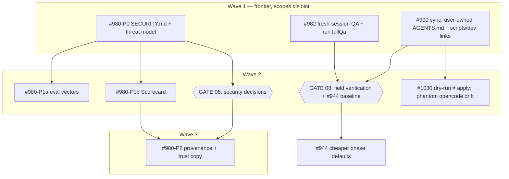

# Issue graph — wave 2, 2026-09

8 nodes: 3 existing issues (one absorbing a second; one split into four
slices) + 2 human gates, plus the edge to #944. Node files: `issues/NN-*.md`.
Conventions: `PLAN.md` §8. Merge consent: stop-at-PR. Plan approved and filed
2026-09-09 (OQ-7 resolved to `sequant-io/sequant-landing`, D13).

## Node → GitHub issue

| Node | Issue | Tier | Wave |
|---|---|---|---|
| 01 | #990 (absorbs #991, closed with a pointer) | mechanical | **1** |
| 02 | #982 | mechanical | **1** |
| 03 | #980 (parent keeps this P0 slice; AC-4 corrected per D11) | judgment | **1** |
| 04 | #1024 — #980-P1a injection-eval vectors | judgment | 2 |
| 05 | #1025 — #980-P1b OpenSSF Scorecard | mechanical | 2 |
| 06 | #1026 — GATE security decisions | human | 2 |
| 07 | #1028 — #980-P2 provenance + trust copy | mechanical | 3 |
| 08 | #1027 — GATE field verification on landing + #944 baseline | human | 2 |
| 09 | #1030 — dry-run ≠ apply: phantom `.claude/opencode/**` drift (field finding, D14) | mechanical | 2 |
| — | #944 carries `Blocked by #1027` (not re-planned) | — | after 08 |

All nodes carry the label `graph-2026-09-w2`.

## Mermaid DAG

## Wave 1 launch (what `/graph-run` reads)

- Nodes 01, 02, 03 in parallel; all `Blocked by: —`.
- Tier policy: 01 and 02 on the current `run.phases` (mechanical); flip to
  all-strong for 03, restore after (D8).
- `run.timeout` ≥ 3600 for 03. Foreground `sequant run` only (I-8).
- Budget: ≈ $30–70 for the wave at the Lab §2 rates; 03 at the top of the range.
- Stop at PR on every node (I-1). Gate 08 cannot be presented until 01 and 02
  are on `main` and a build is available to the downstream project (OQ-7).

## Wave 1 execution record (2026-09-10)

| Node | PR | First QA | Runner action | Second QA |
|---|---|---|---|---|
| 01 #990 | #1036 | AC_NOT_MET (AC-6 `update` clause; `--force` hint at sibling lines; untested preview fn; dead helper) | D16 + fixes in `ee1e54d3` | AC_MET_BUT_NOT_A_PLUS |
| 02 #982 | #1033 | AC_NOT_MET (qa handle overwrote exec's; non-gating test; `KNOWN_KEYS`; 40% uncommitted; AC-3 grep unsatisfiable) | D15 + fixes in `a361ed31`, notes in `2facf50e` | AC_MET_BUT_NOT_A_PLUS |
| 03 #980 | #1035 | AC_NOT_MET (mutation-marker format only) | records re-derived by re-running all five mutations; two doc cells in `9fbf55e7` | AC_MET_BUT_NOT_A_PLUS |

Exec-phase cost of the wave: five dispatches for three nodes — two exec
phases killed at the MCP 30-minute wall, two ended stranded on a
backgrounded test run (D17 → #1032 / PR #1034). Every PR waits for the owner
(I-1); nothing merged.

## Critical path

03 → 06 → 07 (three sequential handoffs, one human). The #944 path is
01/02 → 08 → #944 (one human). Wave 1's longest node is 03 (judgment tier,
new documents plus a resolver test).

## Anti-gap passes

1. **Journey walk.** Downstream user runs `sync` (01) → sees decisions in
   `--dry-run` (01 AC-6) → `doctor` agrees (01 AC-7) → reads the changelog
   (01 AC-8). Orchestrator user enables `--full-qa` from CLI/settings/MCP
   (02 AC-2/3) → qa starts fresh (02 AC-1). Security reviewer reads
   `SECURITY.md` → threat model → OWASP table (03) → eval records (04) →
   Scorecard (05) → README section (07). Every step has one owner.
2. **Artifact walk.** `AGENTS.md` marker (01 AC-1) → preserve/regenerate
   decision (AC-2) → report (AC-6/7). Symlink target (AC-4/5) → `doctor`
   (AC-7). `config.fullQa` from three producers (02 AC-2/3) → env (existing
   consumer). Threat-model rows → resolver test (03 AC-2). Eval record
   `{vector, decision, reason_code, fixture_commit}` (04 AC-3) → threat-model
   eval row (04 AC-6). Field transcripts → investigation doc → gate 08 → #944
   comment. No transformation without an owner and a failure mode (PLAN §6).
3. **Producer/consumer.** Human-produced inputs flagged: gate 06's three
   answers (consumed by 07); OQ-7's downstream project (consumed by 08); the
   OWASP category list (03 spec, OQ-8); the marketplace README source (07
   spec, OQ-9). Every other input has a named producer in the tree.
4. **Shared-file ownership.** `AGENTS.md`: format owned by `agents-md.ts`
   (01); `sync`/`init` write it, `doctor` reads it — one format, one owner.
   `README.md`: line-level regions per node, 03 → 05 → 07 serialized (§8).
   `bin/cli.ts`: one option line each for 01 and 02. `CHANGELOG.md`:
   append-only bullets. `docs/THREAT-MODEL.md`: 03 owns the format; 04 and
   07 edit named rows/paragraphs only. `evals/`: 04 only; the existing case is
   byte-identical (04 scope).
5. **First-episode dry run.** Wave 1 lands three PRs; owner merges; 03's
   merge unblocks 04/05/06 in parallel; 06 answers feed 07; the runner builds
   `main`, links it into the downstream project, runs the 08 transcript and
   the `--full-qa` run, posts the #944 baseline; owner reads 08. Work found
   with no node: none. Work that was in the narrative and is now a node:
   `doctor`'s ownership message (01 AC-7, found in Phase 0) and the source-
   computed guard count (03 AC-4, from the 18-vs-16 finding).

**Reachability.** Every node sits on a path to §2's MVP; #944 is a documented
external consumer, not a wave node.

## Filing plan (after review, in this order)

1. Create label `graph-2026-09-w2`.
2. Edit #990: title → node 01's title; body → node 01 (with the metadata
   line); keep labels `bug,cli`, add the wave label.
3. Close #991 with a comment pointing to #990 and node 01's AC-4/5/7.
4. Edit #982: prepend the metadata line; append the AC verify commands from
   node 02 (the issue's ACs are otherwise unchanged); add the wave label.
5. Edit #980: prepend the metadata line for node 03; replace the AC list with
   node 03's AC-1..7; move AC-4..7 of the old list into the new issues below
   with a "split per W2 PLAN D5" note; correct the AC-4 text per D11.
6. Create 04, 05, 06, 07, 08 in that order (bodies = node files), each with
   the wave label; 06 and 08 also `human-gate` if the label exists.
7. Edit #944: add `Blocked by: #<08>` as the first line of the body.
8. Update this file's node table with the new numbers; commit the
   `docs/internal/graph-2026-09-w2/` tree as `docs(graph): wave 2 plan`.
