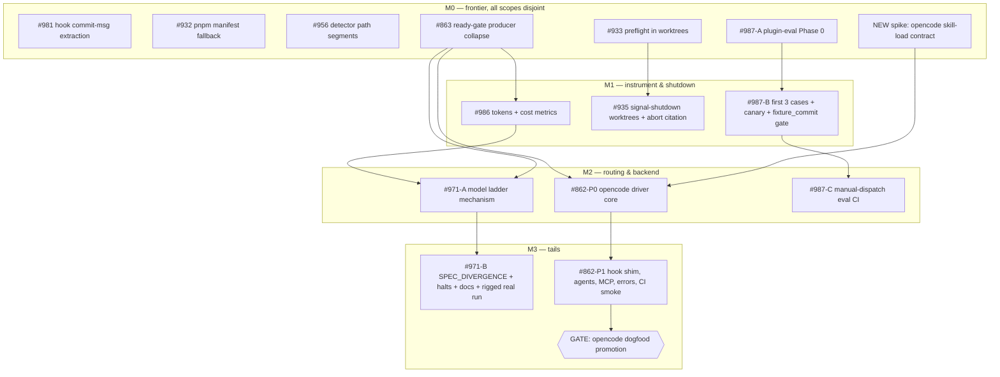

# Issue graph — backlog 2026-09

16 nodes: 10 existing issues (4 of them split into 9 nodes) + 1 new spike +
1 human gate. Node files: `issues/NN-*.md`. Conventions: `PLAN.md` §8.
Merge consent: stop-at-PR. Revision 2 — plan approved and filed 2026-09-06.

## Node → GitHub issue

| Node | Issue | Node | Issue |
|---|---|---|---|
| 01 | #981 | 09 | #935 |
| 02 | #932 | 10 | #993 |
| 03 | #956 | 11 | #971 |
| 04 | #863 | 12 | #862 |
| 05 | #933 | 13 | #994 |
| 06 | #992 (new spike) | 14 | #995 |
| 07 | #987 | 15 | #996 |
| 08 | #986 | 16 | #997 (human gate) |

All sixteen carry the GitHub label `graph-2026-09`. Parent issues #862, #971, #987 keep their first slice; the rest moved to the children above.

## Mermaid DAG

## Waves (stop-at-PR: a wave ends when its PRs are merged by the owner)

| Wave | Nodes | Tier flips needed | Notes |
|---|---|---|---|
| 1 | 01, 02, 03, 04, 05, 06, 07 | 03, 04, 06, 07 → judgment | 7 disjoint scopes; 02's one-line touch on `run-orchestrator.ts:219` is declared parallel-safe with 05. Suggested launch order if capacity is limited: 04, 06, 07 first (they unblock the most), then 01, 02, 03, 05. |
| 2 | 08, 09, 10, 12 | 08, 12 → judgment | 08 after 04 (ready-gate options); 09 after 05 (adjacent orchestrator region); 10 after 07 GO; 12 after 06 GO + 04. |
| 3 | 11, 13, 15 | 11, 15 → judgment | 11 after 08 (metrics-schema); 13 needs the OQ-7 budget number; 15 after 12. |
| 4 | 14, 16 | 14 → judgment; 16 human | 14 after 11; 16 after 15. |

Critical path (longest): 04 → 08 → 11 → 14 (four sequential PRs) and, in
parallel, 06 → 12 → 15 → 16. Everything else is slack.

## Reachability

| Node | On a path to | Note |
|---|---|---|
| 04, 08 | D-cost | |
| 04, 08, 11, 14 | D-ladder | |
| 04, 06, 12, 15, 16 | D-opencode | |
| 07, 10, 13 | D-eval | |
| 01, 02, 03, 05, 09 | none | **deliberate exceptions**: standalone guard/config/heuristic fixes with verbatim repros. 05 and 09 make the runs that D-ladder/D-opencode depend on less likely to fail for unrelated reasons, but this repo is npm and skills are tracked, so they are not on the demo path here. |

## Anti-gap pass results

**1. Journey walk** — every user journey maps to exactly one node:

| Journey | Node |
|---|---|
| commit inside a compound Bash command with an earlier quoted string or trailing heredoc | 01 |
| `sequant run` on a pnpm/yarn/bun project without `packageManager` in the manifest | 02 |
| CI tautology advisory on a `__dirname`/segment-built subprocess test | 03 |
| `sequant ready` / `--ready-gate` on an aider- or opencode-configured project | 04 |
| `sequant run` on a repo whose `.claude/skills` is untracked | 05 |
| `sequant run 123 --agent opencode` (skill loads? traps?) | 06 → 12 → 15 → 16 |
| `claude plugin eval .` on this repo | 07 → 10 → 13 |
| `sequant stats` after a run | 08 |
| SIGTERM/SIGINT mid-run with uncommitted exec work | 09 |
| cheap-model phase stalls with no diff; or converges on fiction; or hits a spec contradiction | 11 (stall) / 14 (contradiction) / OQ-4 (fiction — deferred) |

**2. Artifact walk** — every transformation has an owner and a failure mode:

| Artifact | Producer | Consumer | Failure mode owner |
|---|---|---|---|
| `metrics.json` records (`costUSD`, `phaseUsage[]`) | 08 | `stats`, 11 (escalation rows) | 08 AC-6 (old records load) |
| phase marker fields (`requestedModel`, escalation) | 11 | 14, `doctor` | 11 AC (marker guard) |
| `.sequant/.token-usage-*.json` (fallback) | `capture-tokens.sh` (08) | one helper (08) | 08 AC-3/AC-4 |
| opencode NDJSON fixture | 06 | 12 parser tests | 06 (records KILL if no skill marker) |
| `docs/investigations/opencode-driver-spike.md` | 06 | 12, 15 | — |
| `docs/investigations/plugin-eval-phase0.md` | 07 | 10, 13 | 07 (NO-GO stops 10/13) |
| `evals/**` cases + `evals/results/*` with `fixture_commit` | 10 | 13, gate test | 10 AC (ancestor check) |
| `.opencode/commands/*.md` from one template | 12 | opencode runtime | 12 (generated, never hand-mirrored) |
| producer-parity test allowlist | 04 | 08, 11, 12 (every new field) | I-1 |
| dogfood comparison table | 15 → 16 | owner | 16 reject route |

**3. Producer/consumer** — human-produced inputs, flagged:

| Input | Who | Needed by |
|---|---|---|
| OQ-1/2/4/5/6/11/12 decisions | reviewer at plan review | 08, 09, 11, 04, 05, 10 |
| CI budget number (OQ-7) | owner | 13 |
| opencode provider key / plan | owner's environment | 06, 12, 15, 16 |
| org early access for `plugin eval` (observed present) | Anthropic → owner | 07, 10, 13 |
| PR merges (stop-at-PR) | owner | every wave boundary |
| promotion verdict | owner | 16 |

**4. Shared-file format ownership** — one owner per file two nodes touch:

| File | Owner of format/structure | Others may | Serialization |
|---|---|---|---|
| `src/lib/workflow/run-orchestrator.ts` | region ownership (PLAN §8) | add lines in their region | 05 → 09 → 08 |
| `src/lib/workflow/metrics-schema.ts` | 08 (adds `costUSD`, `phaseUsage`) | 11 appends escalation fields | 08 → 11 |
| `src/lib/workflow/state-schema.ts` | #975 (existing `requestedModel`) | 11 appends rung/trigger; 14 appends `SPEC_DIVERGENCE` outcome | 11 → 14 |
| `src/lib/workflow/ready-gate.ts` | 04 (options struct) | 08 (token helper default), 11 (rung through resolver) | 04 → 08 → 11 |
| `src/lib/workflow/token-utils.ts` | 08 | — | — |
| `src/lib/workflow/effort-escalation.ts` | #915 (existing) | 11 adds the model rung beside `withEscalatedEffort` or in a sibling module | — |
| `bin/cli.ts`, `src/lib/settings.ts` | existing | 11 (`--model-ladder`, `run.modelLadder`), 12 (`run.opencode`) | one line per option; 12 before 11 by wave |
| `src/lib/workflow/drivers/index.ts` | existing registry | 12 adds one entry | — |
| hooks ×3 | 01 (`pre-tool.sh`), 08 (`capture-tokens.sh`) | different files | — |
| skills ×3 | 02 (`setup`), 14 (`exec`, `loop`) | different skills | — |
| `docs/investigations/` | one file per spike | — | — |

No two nodes own the same file in different formats. The one near-miss found:
08 and 11 both write "per-phase rows" into metrics — resolved by making 08 own
`phaseUsage[]` and 11 append escalation columns to the same row shape, not a
second array.

**5. First-episode dry run** — narrated:

Wave 1 launches seven worktrees. The runner flips `run.phases` to all-strong
for 03/04/06/07, launches, restores. 06 needs an opencode provider key in the
worktree's environment: **gap** → node 06 AC-0 states the env precondition and
fails fast without it. 07 creates a throwaway `evals-phase0/` and must delete it
before its PR; the runner's post-PR check greps for `evals/` absence (07 AC).
04's producer-parity test lands the allowlist every later node extends —
**gap** → every later node that adds a config field cites I-1 in its ACs (08,
11, 12). Owner merges seven PRs.

Wave 2: 08's real-run AC cannot be observed from its own worktree — **gap** →
D14: the runner records the first post-merge run's `metrics.json` on #986. 12
builds against 06's fixture; its live test SKIPs where opencode is absent
(CI) and runs locally. 10 authors cases against the plugin root; the qa case's
fixture path is `skills/qa/references/fixtures/injection-issue-body.md` (the
plugin's skills dir, not `templates/`) — **gap** → written into 10's AC.

Wave 3: 11 threads the rung through the resolver 04 collapsed; 13 needs OQ-7
before launch — **gap** → 13 is not launchable until the number is on the
issue; recorded in its metadata. 15's hook shim is security-adjacent →
`--security-review` flag recorded in its node file.

Wave 4: 14's rigged real run needs a fixture issue with an impossible AC — a
throwaway issue on this repo, closed after — **gap** → 14 AC names the fixture
issue creation as part of scope. 16 is a human gate reading 15's table.

Work no node covers after this pass: none found. Work the pass moved into a
node: five gaps above, each now an AC or a metadata precondition.
