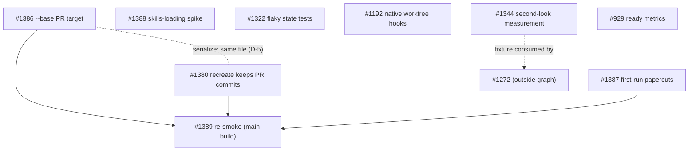

# Issue graph: graph-2026-10-freeze

**Status:** Approved and filed 2026-10-09. From filing on, the issue bodies on GitHub are canonical and `amendments/*.md` is the as-filed snapshot.
**Founding doc:** `PROJECT-DISCUSSION.md` (cited as §N). **Tracker:** #1390.

## Nodes

| Node | Tier | Execution | Title | Blocked by | May touch | Cluster |
|---|---|---|---|---|---|---|
| #1386 | mechanical | sequant_run | `--base` PR targets the default branch | — | `batch-executor.ts`, `worktree-manager.ts` (`createPR`) | worktree-manager |
| #1380 | judgment | sequant_run | recreate drops a PR branch's commits | — (serialize with #1386, D-5) | `worktree-manager.ts` (`ensureWorktree`) | worktree-manager |
| #1387 | mechanical | sequant_run | five first-run papercuts | — | `bin/cli.ts`, `init.ts`, `doctor.ts`, `run-renderer.ts`, README | — |
| #1388 | judgment | runner | spike: skills via the SDK `plugins` option | — | `docs/adr/` (docs-only merge) | — |
| #1322 | judgment | split | flaky state tests under full-suite load | — | state tests and setup | — |
| #1192 | judgment | sequant_run | native `WorktreeCreate` hooks vs `worktree-isolation.ts` | — | `docs/investigations/` | — |
| #1344 | judgment | runner | measure the shipped second look (owns the held-out fixture) | — | `docs/investigations/`, the private fixture repo | — |
| #929 | mechanical | sequant_run | `sequant ready` records run metrics | — (D-3 accepted 2026-10-09) | `ready.ts`, metrics, `stats.ts` | — |
| #1389 (R-1) | judgment | runner | re-smoke a `main` build as a stranger | #1386, #1380, #1387 | none in the repo; a private fixture branch | — |

## File-overlap clusters (serialize within a cluster)

- **worktree-manager:** #1386 (`createPR`), #1380 (`ensureWorktree`). Disjoint functions, same file. Default order #1386 then #1380 (D-5).
- **CHANGELOG `[Unreleased]`:** every code node. Expect trivial conflicts; resolve with a local `git merge origin/main`.

## DAG

## Waves (file-disjoint within each wave; merges one at a time, `main` strict up to date)

- **Wave 1:** #1386, #1387 and #1322's fix as three parallel `sequant_run` calls, one issue each (the MCP watchdog counts phase boundaries per call). #1388 runs in the runner session at the same time (I-6) and merges docs only. #1322's full-suite evidence is produced by the runner after its PR opens.
- **Wave 2:** #1380 (after #1386 merges), #1192, #929, #1344 (spec and fixture build; long-running and human-adjudicated, so it starts in wave 2 and may run past wave 3).
- **Wave 3:** #1389, once #1386, #1380 and #1387 have merged.

## Critical path

#1386 → #1380 → #1389. Each merge needs about 9 minutes of CI plus an update-branch cycle whenever `main` moves (#1368's merge queue would remove that cost).

## Anti-gap passes (run 2026-10-09)

1. **Journey walk** (stranger: install → init → doctor → commit → run → PR → second run): install, nothing to fix (passed 2026-10-09); init and doctor, #1387; commit size, #1388; run against a non-default base, #1386; a second run on a stale PR branch, #1380; the PR, #1386; trusting CI, #1322. Every step maps to one node. **Gap found and closed:** nothing checked the fixes together, so #1389 was added.
2. **Artifact walk:** resolved base → worktree, rebase, PR (#1386 owns the parity test); recreated branch (#1380); first-run output text (#1387); metrics record (#929); held-out fixture (#1344); ADRs and notes (#1388, #1192). Each has one owner and a named failure mode (§6).
3. **Producer/consumer:** #1389 consumes `npm pack` of `main` (produced by the merges, after #1386, #1380 and #1387). #929 consumes the owner's D-3 decision (a human dependency, flagged). #1344 consumes the calibration grader (#1313, done). #1388 consumes `node_modules/sequant/plugin` (shipped by the npm package, checked 2026-10-09).
4. **Shared-file ownership:** `worktree-manager.ts` has two writers (#1386 `createPR`, #1380 `ensureWorktree`): disjoint functions, serialized (D-5). The held-out fixture has two would-be owners: assigned to #1344, with #1272 consuming it (D-4). `CHANGELOG.md` `[Unreleased]` is touched by every code node, so expect trivial merge conflicts until #1351 lands after the freeze; resolve with a local `git merge origin/main` (the union driver is local only).
5. **First-episode dry run:** wave 1 launches four runs; each opens a PR; the runner verifies, mutation-checks and rewrites placeholder bodies; the owner consents; the runner merges one at a time with the I-1 check. Wave 2 has #1380's spec answer OQ-2 before exec. #1389 runs under `launchctl`. **Gap found:** no release can carry the fixes (D-1). It's recorded as an explicit post-freeze step (§10), not as a node, because a release breaks the freeze.

**Reachability:** #1386, #1380, #1387 and #1389 are on the §2 MVP path. #1322 supports the merge gate every MVP merge passes through. #1388, #1192, #1344 and #929 are deliberate exceptions: decisions and measurements the compass asked for, which don't block the MVP.

## Edits to apply at filing (after review)

0. `gh label create graph-2026-10-freeze` (the epic label doesn't exist yet).
1. Replace the bodies of #1386, #1380, #1387, #1388, #1322, #1192, #1344 and #929 with `amendments/<N>.md`. Each keeps its original text and adds the metadata line, Non-Goals and May touch; bug fixes get Prior fixes / producers. #1380, #1322 and #929 also get Evidence-form ACs, and #1344's AC-1, AC-2 and AC-5 Evidence is reworded so prose isn't read as a gate test.
2. File #1389 from `amendments/R1.md`.
3. Add one line to #1272: "Consumes #1344's held-out fixture (graph-2026-10-freeze D-4)."
4. File a tracker issue with this table (including the Execution column), the file-overlap clusters section verbatim, and the DAG, with no closing keywords.
5. Commit `PROJECT-DISCUSSION.md` and `issue-graph.md` to `docs/internal/graph-2026-10-freeze/` in a docs-only PR (I-1 safe).
